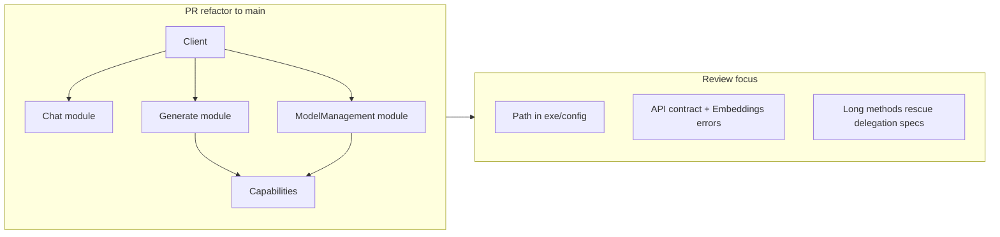

<!-- e04b35a4-6926-4ef4-a33a-a5655722be46 -->
# Code Review: PR refactor → main

**Scope:** All changes in `git diff main...refactor` (lib/, spec/, exe/, examples/, config, docs).  
**Types:** Library (lib/**), RSpec (spec/**), CLI (exe/), examples.  
**Project patterns:** Single entry point `Ollama::Client` with modules Chat, Generate, ModelManagement; WebMock for HTTP; config per client; API_CONTRACT.md defines public surface.

---

## 1. CRITICAL

### 1.1 User input in file path (path traversal risk)

**File:** `exe/ollama-client` (and any caller of `Config.load_from_json` with user-controlled path)

**Issue:** `--schema FILE` and `Config.load_from_json(path)` use paths without validation. A user can pass `../../etc/passwd` or similar; `File.read(options[:schema])` and `File.read(path)` are then used. If the path is user-controlled, this is a path traversal / information disclosure risk.

**Fix:**
- Validate path is under a safe base (e.g. current dir or explicit config directory) or normalize and reject `..` segments when the path is user-supplied.
- Document that `Config.load_from_json(path)` must only be given trusted paths.

**Rule:** Code-review skill — "User input in file paths, shell commands, or redirects."

---

## 2. PERFORMANCE

- **HTTP timeouts:** All HTTP calls use `@config.timeout` (or multiples for pull/create/push). No missing timeout on external calls.  
- **No N+1 / AR:** Gem is HTTP-only; no ActiveRecord.  
- **list_model_names:** Calls `list_models` then `.map { |m| m["name"] }` — one HTTP request; acceptable. No separate lighter endpoint in Ollama API.

**Verdict:** No performance findings to flag.

---

## 3. PROJECT CONSISTENCY

### 3.1 API contract omits `return_reasoning`

**File:** `API_CONTRACT.md`

**Issue:** `generate` supports `return_reasoning: false` and returns `Hash` with `"reasoning"` and `"final"` when true. The contract table does not list `return_reasoning` or the return shape for that case. The rest of the codebase documents public method signatures in API_CONTRACT.md — this branch does not.

**Fix:** Add `return_reasoning` to the generate row and document return type: when `return_reasoning: true`, returns `Hash` with keys `"reasoning"` and `"final"`.

**Rule:** Project consistency — "The rest of the codebase does X — this does Y."

### 3.2 Embeddings HTTP error message vs Client

**File:** `lib/ollama/embeddings.rb` (e.g. `handle_http_error`)

**Issue:** Client uses `extract_error_message(res)` so 404 bodies like `{"error": "model not found"}` become the raised message. Embeddings uses `res.message` (HTTP status line). Same API, different error message source.

**Fix:** Either reuse Client’s error extraction (e.g. inject a helper or call a shared method) or add a one-line extraction in Embeddings so 404/5xx messages match the chat/generate behavior.

**Rule:** Project consistency — same error format for same API.

---

## 4. BEST PRACTICES (SOLID / design / RSpec)

### 4.1 Long method and RuboCop disables — `chat`

**File:** `lib/ollama/client/chat.rb` (e.g. lines 19–66)

**Issue:** `chat` is long and carries multiple RuboCop disables (MethodLength, CyclomaticComplexity, PerceivedComplexity, ParameterLists, AbcSize). Solid-ruby and method rules prefer short methods and avoiding boolean/flag-heavy signatures.

**Fix:** Extract building of request body and streaming vs non-streaming into small private methods (e.g. `build_chat_body`, `perform_chat_request`, `stream_or_parse`) to reduce length and complexity; then remove or narrow disables.

**Rule:** solid-ruby — methods &lt; ~10 lines; avoid long parameter lists.

### 4.2 Long method and disables — `generate` and `call_generate_api`

**File:** `lib/ollama/client/generate.rb`

**Issue:** `generate` and `call_generate_api` are long and heavily disabled for metrics. Retry loop and response formatting could be extracted to named methods.

**Fix:** Extract e.g. `run_generate_with_retries`, `handle_generate_retry`, `build_generate_body` so each method does one thing; reduce disables.

**Rule:** solid-ruby — single responsibility; methods short and focused.

### 4.3 Default argument using instance state — `generate`

**File:** `lib/ollama/client/generate.rb` (e.g. `strict: @config.strict_json`)

**Issue:** Default value `strict: @config.strict_json` depends on instance state. Works but is unusual in Ruby and can be surprising for readers.

**Fix:** Prefer `strict: nil` and set `strict = @config.strict_json if strict.nil?` at the start of the method, or document clearly that the default is per-client config.

**Rule:** ruby-style — optional/boolean args; clarity of defaults.

### 4.4 Broad rescue then re-raise — Chat and Generate

**File:** `lib/ollama/client/chat.rb` (e.g. `rescue StandardError`), `lib/ollama/client/generate.rb` (e.g. `rescue StandardError`)

**Issue:** Rescuing `StandardError` to call `hooks[:on_error]&.call(e)` and then re-raise is intentional for observer behavior but very broad. It can pull in programming errors (NoMethodError, ArgumentError, etc.) and expose them as “stream errors.”

**Fix:** Consider rescuing a narrower set (e.g. `TimeoutError`, `Error`, and network errors) and calling the hook only for those; let other exceptions bubble without invoking the hook. If the current behavior is intentional, add a short comment explaining why.

**Rule:** ruby-style — rescue specific exceptions; put more specific rescues first.

### 4.5 RSpec — thinking spec and global config

**File:** `spec/ollama/client_thinking_spec.rb` (e.g. `before { Ollama::Config.new }`)

**Issue:** `before { Ollama::Config.new }` only creates a config; it doesn’t set it as the client’s config. The examples use `described_class.new` without an explicit config, so they depend on `default_config` (e.g. `OllamaClient.config` when defined). The intent of the before block is unclear and could be misleading.

**Fix:** Either set a known config on the client (e.g. `let(:client) { described_class.new(config: Ollama::Config.new) }`) and remove the redundant `Ollama::Config.new`, or document why creating a global config is required.

**Rule:** RSpec — explicit setup; tests should describe behavior, not depend on hidden global state.

### 4.6 Response#method_missing and delegation

**File:** `lib/ollama/response.rb` (e.g. `method_missing`, `respond_to_missing?`)

**Issue:** Delegating to `@data` via `method_missing` makes the response’s public surface unbounded and can hide typos or API drift. The public API is already documented in API_CONTRACT.md with explicit accessors.

**Fix:** Prefer explicit accessors for all supported keys and avoid delegating arbitrary methods to `@data`; or clearly document that any key on the underlying hash is part of the public interface and add a short comment above `method_missing`.

**Rule:** solid-ruby / ruby-design-patterns — clear interfaces; avoid unnecessary use of method_missing.

---

## 5. STYLE (ruby-style)

- **Leading dot in chains:** Multi-line chains are consistent.  
- **Guard clauses:** Used well (e.g. `raise ArgumentError` for missing messages/prompt).  
- **Hash key style:** Mix of string and symbol keys from API; internal use of symbols for opts is consistent.  
- **Line length:** Some long lines in generate/chat (e.g. body building); could break for 80–120 chars if the team enforces it.

No separate style-only findings beyond what’s already covered (e.g. default arg, method length).

---

## 6. VERDICT

**Verdict: NEEDS FIXES**

- Critical: 1 (path traversal / user input in file path)
- Performance: 0
- Consistency: 2 (API contract, Embeddings error message)
- Best practice: 6 (long methods/disables, default arg, rescue breadth, RSpec setup, Response delegation)
- Style: 0

**Must fix before merge**

1. Harden or document file path usage for `--schema FILE` and `Config.load_from_json` when path is user-controlled (see 1.1).

**Should fix before merge (recommended)**

2. Update API_CONTRACT.md for `return_reasoning` and return shape (3.1).  
3. Align Embeddings HTTP error messages with Client (3.2).  
4. Narrow `rescue StandardError` in chat/generate or document intent (4.4).  
5. Clarify or fix client_thinking_spec setup (4.5).

**Can fix in follow-up**

6. Shorten `chat` / `generate` / `call_generate_api` and reduce RuboCop disables (4.1, 4.2).  
7. Default `strict` without instance state in signature (4.3).  
8. Restrict or document Response#method_missing (4.6).

---

## 7. Summary diagram

After applying fixes, re-run `bundle exec rspec` and `bundle exec rubocop` to confirm nothing regresses.
